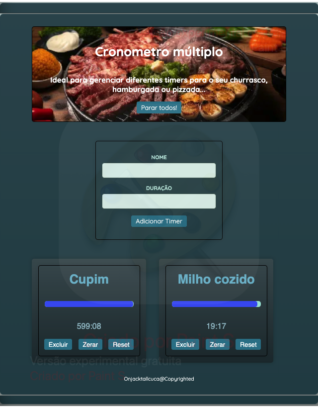

# CookTimers
Projeto usando os conceitos de useState, useRef, useContext entre outros hooks do react.

Steps:
  Git clone
  cd CookTimers
  cd 01 Starting Project
  yarn install
  yarn dev

O projeto por padrão vai rodar em:  Local:   http://localhost:5173/

